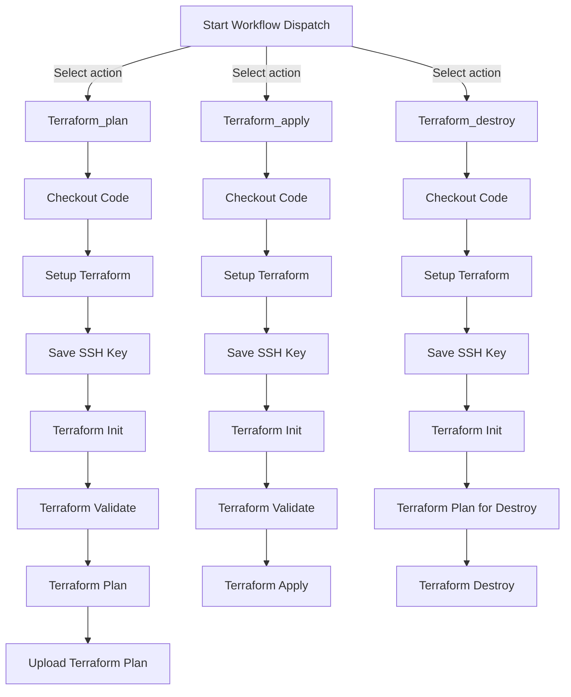

    # AWS Terraform Ansible Nginx Setup

This repository contains the necessary files and instructions to set up an AWS infrastructure using Terraform, configure it with Ansible, and deploy an Nginx web server.

## Content

- [Prerequisites](#prerequisites)
- [Getting Started](#getting-started)
- [Directory Structure](#directory-structure)
- [GitHub Actions](#github-actions)
  - [Workflow Dispatch Inputs](#workflow-dispatch-inputs)
  - [Environment Variables](#environment-variables)
  - [Workflow Jobs](#workflow-jobs)
  - [Workflow Diagram](#workflow-diagram)
- [Contributing](#contributing)
- [Points to Improve](#points-to-improve)

## [Prerequisites](#prerequisites)

Before you begin, make sure you have the following:

- [Terraform](https://www.terraform.io/downloads.html) v1.2.3 or newer.
- [Terraform Provider for AWS](https://www.terraform.io/docs/providers/aws/index.html) 5.55.0 or newer.
- [Ansible](https://docs.ansible.com/ansible/latest/installation_guide/intro_installation.html) ansible [core 2.14.1] or newer.


## [Getting Started](#getting-started)

To get started with this setup, follow these steps:

1. Clone this repository to your local machine.
2. Navigate to the project directory: `AWS-Terraform-Ansible-Nginx-Setup`.
3. Update the `terraform.tfvars` with desired registered domain name, vpc address range and ssh key for ec2 instance.
4. Run `terraform init` to initialize the Terraform project or go to the any of resources directory and run make init.
5. Run `terraform apply` to create the AWS infrastructure.
6. Once the infrastructure is created, run `00_install.sh` and `10_update_nginx_conf.sh` to configure the instances with Nginx.
7. Access the Nginx web server by navigating to the public IP address of the created EC2 instance in your web browser.

## [Directory Structure](#directory-structure)

The repository is organized as follows:

```
├── README.md
├── ansible
│   ├── ec2-nginx
│   │   ├── 00_install.sh
│   │   ├── 10_update_nginx_conf.sh
│   │   ├── README.md
│   │   ├── ansible.cfg
│   │   └── inventorydev.ini
│   └── play-books
│       ├── 1_install_nginx_certbot.yml
│       ├── 2_update_nginx_conf.yaml
│       ├── ansible.cfg
│       └── file
│           └── nginx
│               ├── default.j2
│               ├── default_for_https.j2
│               └── dog-facts
│                   ├── index.html
│                   ├── script.js
│                   └── style.css
└── terraform
    └── dev
        ├── 0_route53
        │   ├── main.tf
        │   ├── makefile
        │   └── variables.tf
        ├── 0_terraform_user
        │   ├── main.tf
        │   ├── makefile
        │   └── variables.tf
        ├── 1_ec2
        │   ├── ami.tf
        │   ├── create.plan
        │   ├── main.tf
        │   ├── makefile
        │   ├── outputs.tf
        │   ├── userdata.tpl
        │   ├── users.tf
        │   └── variables.tf
        ├── _env_config
        │   └── dev.tfvars
        └── s3-public
            ├── file.txt
            ├── main.tf
            ├── makefile
            └── variables.tf
```


- The `terraform` directory contains the Terraform configuration files.
[](https://asciinema.org/a/666740))
- The `README.md` file provides instructions and information about the repository.
- The `ansible` directory contains the Ansible inventory file and playbook for configuring the instances.
[](https://asciinema.org/a/666741)


## [GitHub Actions](#github-actions)

 Terraform Operations Workflow

This document explains the GitHub Actions workflow defined in `terraform-ops.yml`. This workflow facilitates Terraform operations such as plan, apply, and destroy, based on user inputs during the workflow dispatch event.

### [Workflow Dispatch Inputs](#workflow-dispatch-inputs)

The workflow is triggered manually through GitHub's workflow dispatch event. It accepts two inputs from the user:

1. **resource**: The Terraform resource directory to operate on.
2. **action**: The Terraform action to perform (`Terraform_plan`, `Terraform_apply`, `Terraform_destroy`).

### [Environment Variables](#environment-variables)

The workflow uses the following environment variables, which should be set in the repository's secrets:

- `AWS_ACCESS_KEY_ID`
- `AWS_SECRET_ACCESS_KEY`
- `AWS_DEFAULT_REGION`
- `TERRAFORM_SSH_KEY`

### [Workflow Jobs](#workflow-jobs)

The workflow consists of three jobs:

1. **terraform_apply**: Executes `terraform apply` on the specified resource.
2. **terraform_plan**: Executes `terraform plan` and uploads the plan as an artifact.
3. **terraform_destroy**: Executes `terraform destroy` on the specified resource.

### [Workflow Diagram](#workflow-diagram)



## [Contributing](#contributing)

If you would like to contribute to this project, please follow these guidelines:

1. Fork the repository.
2. Create a new branch for your feature or bug fix.
3. Make your changes and commit them.
4. Push your changes to your forked repository.
5. Submit a pull request to the main repository.


## [Points to Improve](#points-to-improve)

Since GitHub actions were only added for personal conviniency there are a few points for future imrpovement.

1. Submit plan as comment in PR.
2. Use plan artifact to the corresponding resource.
3. Run apply and destroy only on master branch and after PR was merged.