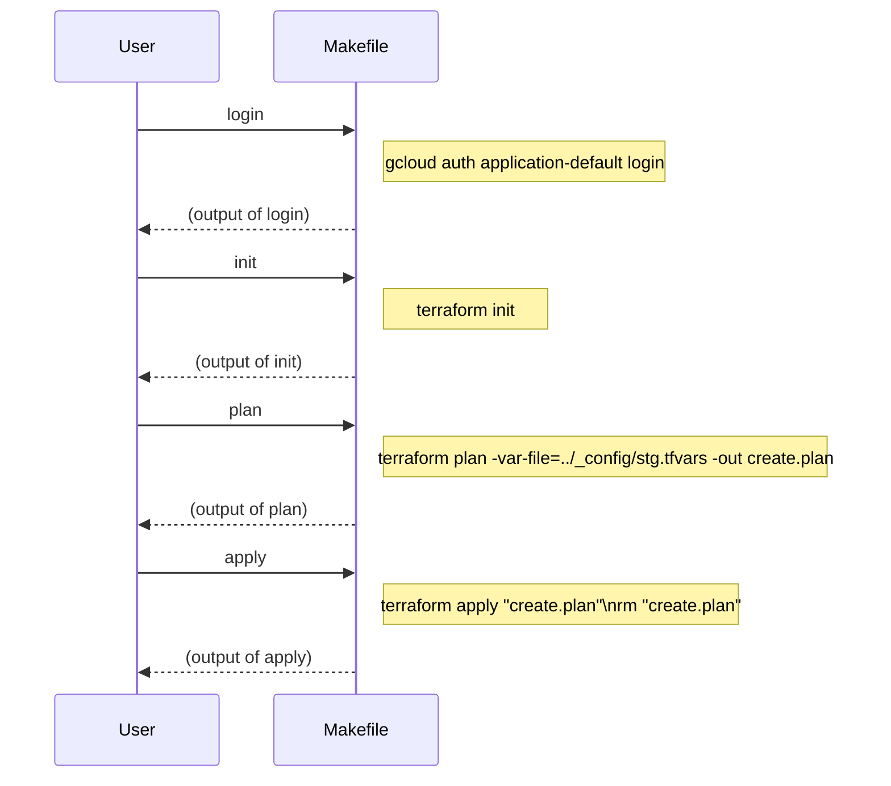

# To create private etcd vms cluster

```bash
bash 00_deploy.sh
```

## State file location

```
terraform {
  backend "gcs" {
    bucket = "rpay-unbrk3-tf-state"
    prefix = "terraform/state/stg/2_etcd_vms"
  }
}
```

## Targets

The following targets are available:

- `default`: This is the default target and will print a message to the console asking the user to specify a target.
- `login`: This target will run the gcloud auth application-default login command to log in to Google Cloud.
- `init`: This target will run the terraform init command to initialize a new or existing Terraform working directory.
- `plan`: This target will run the terraform plan command with the specified variables file and output the plan to a file called create.plan.
- `refresh`: This target will run the terraform refresh command with the specified variables file to update the state file.
- `apply`: This target will apply the Terraform plan in create.plan file and remove the file after apply.
- `validate`: This target will run the terraform validate command to check and report the syntax of the Terraform configuration files.
- `fmt`: This target will run the terraform fmt command to rewrite Terraform configuration files to a canonical format.
- `destroy`: This target will run the terraform destroy command with the specified variables file to destroy the infrastructure.

Usage
To use this Makefile, run the make command with the desired target. For example, to initialize a Terraform working directory, run the following command:

```bash
make init
```

To apply the Terraform plan, run the following command:

```bash
make apply
```

Note that you need to run the login target before running any other target, as the Google Cloud credentials are required to execute the other targets.

Sequence Diagram
Here is a sequence diagram that shows the flow of control between the user and the Makefile when executing the `login`, `init`, `plan`, and `apply` targets:



